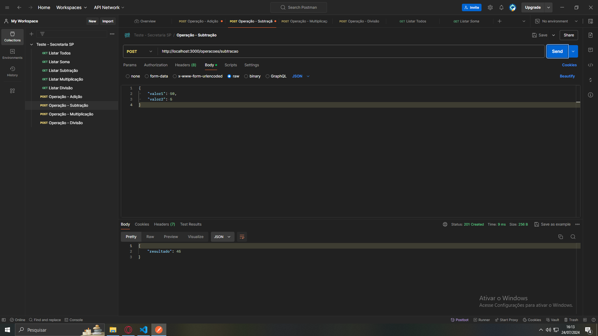
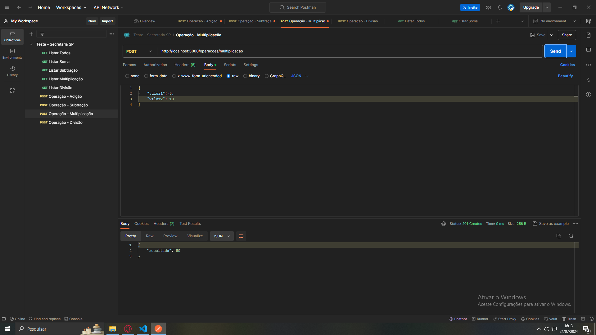
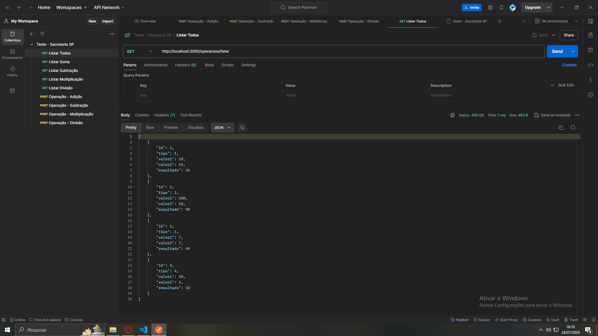
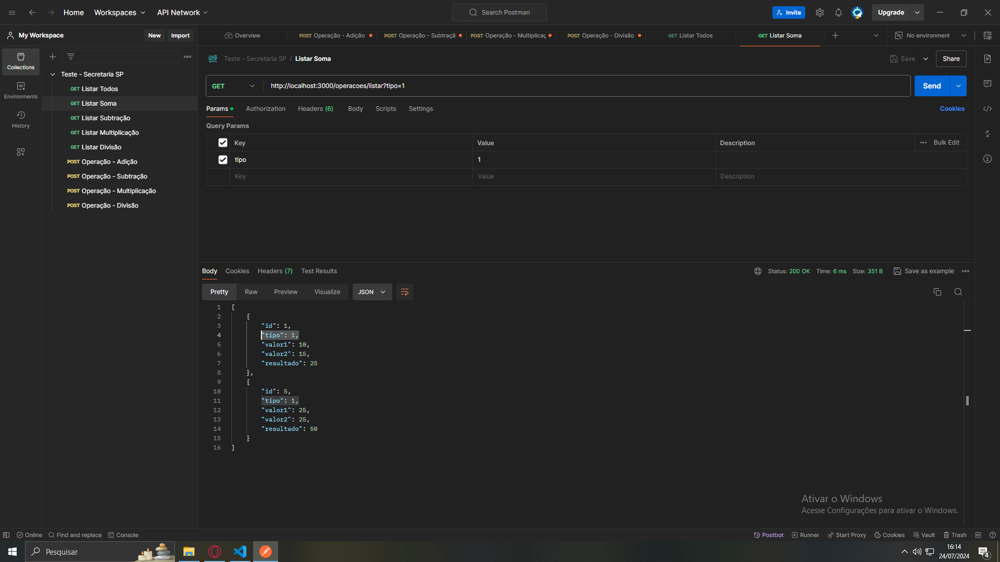
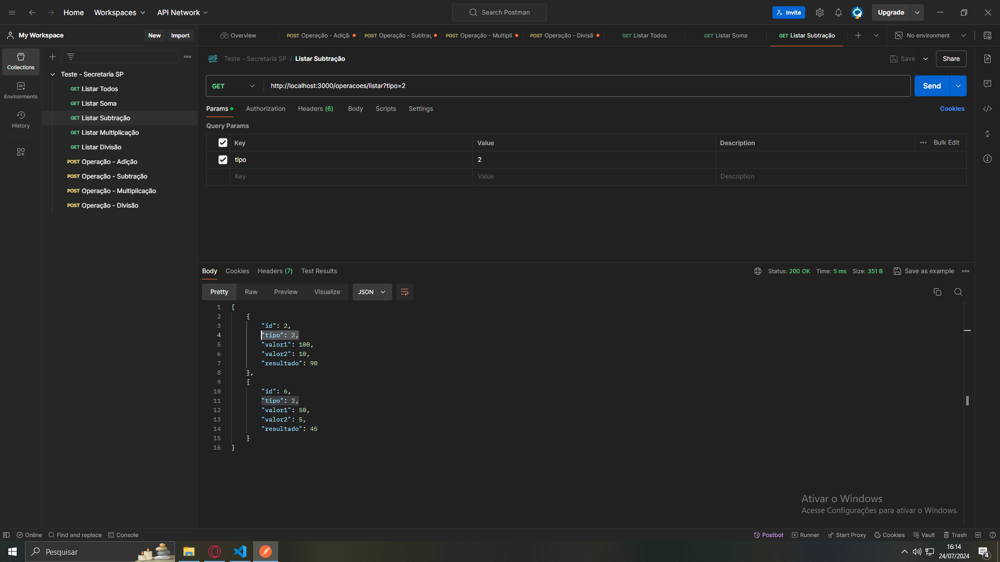
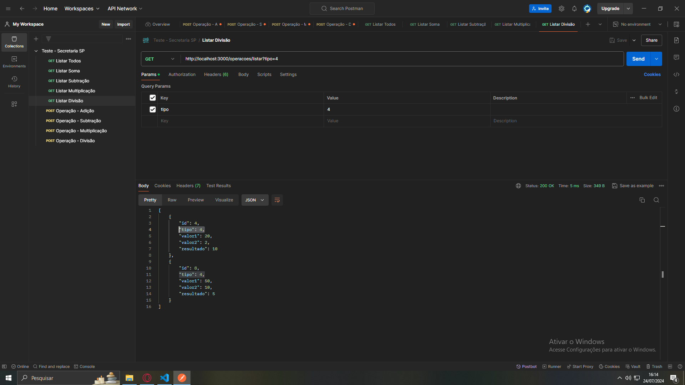

## Tarefa 1

Criação dos endpoints para as operações matemáticas básicas:

- Adição:

- Subtração:

- Multiplicação:

- Divisão:

## Tarefa 2

Criação dos endpoint para consultar todas as operações registradas e filtrar a pesquisa por tipo de operação:

- Listar Todas:

- Listar Adição:

- Listar Subtração:

- Listar Multiplicação:

- Listar Divisão:
